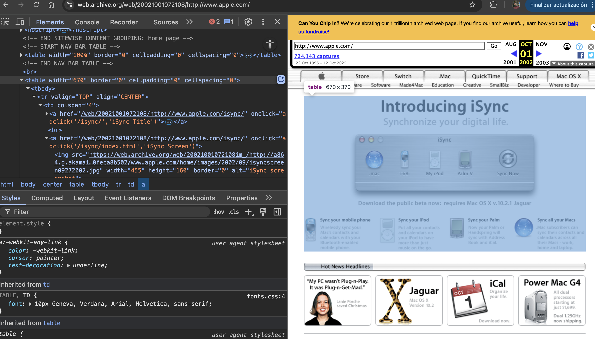

# Cómo suprimir información de accesibilidad

Podemos eliminar la información de accesibilidad utilizando el estilo <code>display: none</code> en **CSS** ó usando el atributo <code>hidden</code> en **HTML**. 
Sin embargo, esto no sólo esconderá el contenido a la tecnología asistiva.

**ARIA** provée un método para esconder de forma exclusiva un contenido a tecnología asistiva:
- <code>aria-hidden="true"</code>

A veces, es confundido con otro método de **ARIA** que utilizamos para eliminar la semántica de un elemento:
- <code>role="presentation" ó role="none"</code>

Veamos sus diferencias y buenos usos.

:::warning[Advertencia]
Esconder contenido a tecnología asistiva suele considerarse una mala práctica. Una posible regla a seguir:
"si necesito esconder algo a algunos usuarios, posiblemente deba esconderlo a todos."
Entiende bien estas técnicas y valora si realmente es necesario.
:::

## Escondiendo contenido con aria-hidden="true"
Cuando se utiliza el atributo <code>aria-hidden="true"</code> sobre un nodo, éste es eliminado del
árbol de accesibilidad, así cómo sus descendientes.

```html
<p aria-hidden="true">Este contenido es escondido a tecnología asistiva.</p>
```

<em aria-hidden="true">Este contenido es escondido a tecnología asistiva.</em>

:::info
El párrafo anterior es escondido a tecnología asistiva, pero no visualmente. 
Resultará muy extraño para algunos usuarios, que utilicen tecnología asistiva y tengan visión, que
este párrafo no pueda ser alcanzable a pesar de ser visible.
:::

Debemos de utilizar este atributo cuando queremos esconder contenido a tecnología asistiva que 
no es considerado decorativo.

### Ejemplo de buen uso de aria-hidden
En el ejemplo siguiente, mostramos un enlace con un icono para reforzar visualmente la dirección del mismo 
(pantalla principal). Si mostramos el enlace y el icono a la tecnología asistiva, estaríamos duplicando el 
contenido que anunciamos. Más que reforzar el mensaje, estamos generando ruido de forma innecesaria.

Por ello, podemos utilizar <code>aria-hidden="true"</code> en el icono para eliminarlo del árbol de accesibilidad,
y así esconderlo a tecnología asistiva.


```jsx
<a href="/" style={{ display: "flex", alignItems: "center", width: "fit-content", padding: "0.5rem", height: "3rem", background: "white", color: "black" }}>
    <span style={{ width: "2rem" }}>
        <svg aria-hidden="true" version="1.1" style={{ width: "", height: "100%" }} xmlns="http://www.w3.org/2000/svg" x="0px" y="0px" viewBox="0 0 122.88 112.07"><g><path d="M61.44,0L0,60.18l14.99,7.87L61.04,19.7l46.85,48.36l14.99-7.87L61.44,0L61.44,0z M18.26,69.63L18.26,69.63 L61.5,26.38l43.11,43.25h0v0v42.43H73.12V82.09H49.49v29.97H18.26V69.63L18.26,69.63L18.26,69.63z"/></g></svg>
    </span>
    <span>Pantalla principal</span>
</a>
```

<a href="/" style={{ display: "flex", alignItems: "center", width: "fit-content", padding: "0.5rem", height: "3rem", background: "white", color: "black" }}>
    <span style={{ width: "2rem" }}>
        <svg aria-hidden="true" version="1.1" style={{ width: "", height: "100%" }} xmlns="http://www.w3.org/2000/svg" x="0px" y="0px" viewBox="0 0 122.88 112.07"><g><path d="M61.44,0L0,60.18l14.99,7.87L61.04,19.7l46.85,48.36l14.99-7.87L61.44,0L61.44,0z M18.26,69.63L18.26,69.63 L61.5,26.38l43.11,43.25h0v0v42.43H73.12V82.09H49.49v29.97H18.26V69.63L18.26,69.63L18.26,69.63z"/></g></svg>
    </span>
    <span>Pantalla principal</span>
</a>

## Eliminando la semántica con role="presentation"
Se utiliza el <code>role="presentation"</code> ó su equivalente <code>role="none"</code>, cuando queremos
eliminar la semántica de un elemento.

### Ejemplo de buen uso de role="presentation"
En el ejemplo siguiente, nos encontramos con un código **HTML** generado por un framework muy antiguo. Antes de que
existieran métodos modernos para posicionar nuestros componentes en **CSS** como **flex** ó **grid**, se solía maquetar
utilizando tablas.

Podemos encontrarnos múltiples ejemplos de esto. Me encanta tirar de hemeroteca e investigar las páginas de compañías como **Apple**
años atrás. Vemos como [Apple en 2003](https://web.archive.org/web/20021001072108/http://www.apple.com/) hacía un uso bastante avanzado de este tipo de maquetación.


Para evitar que estos elementos, que son usados sólo por fines decorativos, no semánticos; transmitan una incorrecta información a la tecnología
asistiva, podemos usar el <code>rol="presentation"</code>. Esto tratará al elemento como si fuera un <code>div</code>.

```jsx
<a href="/" style={{ display: "block", width: "fit-content", background: "white", color: "black" }}>
    <table
        role="presentation"
        style={{
            borderCollapse: "collapse",
            background: "inherit",
            height: "3rem"
        }}
    >
        <tbody>
            <tr>
                <td style={{ verticalAlign: "middle", height: "2rem", padding: 0, border: "none" }}>
                    <span>
                        <svg
                        aria-hidden="true"
                        version="1.1"
                        style={{ height: "100%" }}
                        xmlns="http://www.w3.org/2000/svg"
                        viewBox="0 0 122.88 112.07"
                        >
                        <g>
                            <path d="M61.44,0L0,60.18l14.99,7.87L61.04,19.7l46.85,48.36l14.99-7.87L61.44,0L61.44,0z M18.26,69.63L18.26,69.63 L61.5,26.38l43.11,43.25h0v0v42.43H73.12V82.09H49.49v29.97H18.26V69.63L18.26,69.63L18.26,69.63z"/>
                        </g>
                        </svg>
                    </span>
                </td>
                <td style={{ verticalAlign: "middle", padding: 0, border: "none" }}>
                    <span>Pantalla principal</span>
                </td>
            </tr>
        </tbody>
    </table>
</a>
```

<a href="/" style={{ display: "block", width: "fit-content", background: "white", color: "black" }}>
    <table
        role="presentation"
        style={{
            borderCollapse: "collapse",
            background: "inherit",
            height: "3rem"
        }}
    >
        <tbody>
            <tr>
                <td style={{ verticalAlign: "middle", height: "2rem", padding: 0, border: "none" }}>
                    <span>
                        <svg
                        aria-hidden="true"
                        version="1.1"
                        style={{ height: "100%" }}
                        xmlns="http://www.w3.org/2000/svg"
                        viewBox="0 0 122.88 112.07"
                        >
                        <g>
                            <path d="M61.44,0L0,60.18l14.99,7.87L61.04,19.7l46.85,48.36l14.99-7.87L61.44,0L61.44,0z M18.26,69.63L18.26,69.63 L61.5,26.38l43.11,43.25h0v0v42.43H73.12V82.09H49.49v29.97H18.26V69.63L18.26,69.63L18.26,69.63z"/>
                        </g>
                        </svg>
                    </span>
                </td>
                <td style={{ verticalAlign: "middle", padding: 0, border: "none" }}>
                    <span>Pantalla principal</span>
                </td>
            </tr>
        </tbody>
    </table>
</a>


