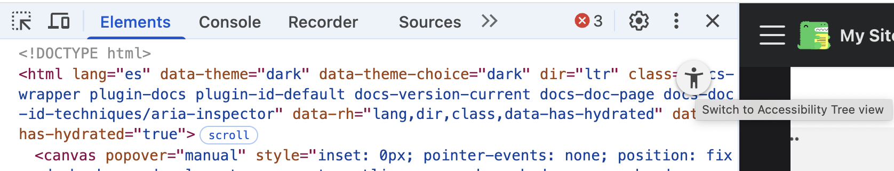

# Dónde encontrar la información de accesibilidad y ARIA

Cuando abrimos una página web en un navegador, el navegador convierte el marcado en una representación
en forma de árbol llamada *DOM* (**Document Object Model**). Éste árbol contiene los elementos, atributos y textos 
que conforman un sitio web.

Una vez el **DOM** se crea, los navegadores crean el *árbol de accesibilidad*. Éste será usado por las 
**APIS de accesibilidad** para que la web sea entendida por la tecnología asistiva.

## Propiedades del árbol de accesibilidad
- rol: indica qué tipo de elemento es un nodo: botón, link, tabla, etc.
    

        <button>Mover a la papelera</button>
    

- nombre: nos solemos referir a esta propiedad como nombre accesible. Por ejemplo, un botón con el texto "Mover a la papelera" tendrá
el nombre "Mover a la papelera".
    

        <button>Mover a la papelera</button>
    

- descripción: es información extra al nombre. En el siguiente ejemplo, el párrafo que acompaña al botón es usado como su descripción gracias a 
ARIA.
    

        <button aria-describedby="papelera__descripcion">Mover a la papelera</button>
        
Los elementos se eliminarán de la papelera a los 30 días.

    

- estado: si tiene atributos adicionales. Algunos ejemplos son: colapsado, presionado, abre un popup, seleccionado, etc.
    

        <button aria-describedby="papelera__descripcion" disabled>Mover a la papelera</button>
        
Los elementos se eliminarán de la papelera a los 30 días.

    

## Cómo activar el árbol de accesibilidad
En Google Chrome:
- Abrir devtools
- Desde "Elementos", Ir a la tab de accesibilidad. Se encuentra en la barra donde está "Estilos".
    
- Activar el árbol de accesibilidad a vista completa. Debemos de marcar el checkbox.
    
- Recargar devtools
- Ya podemos clicar en el icono para saltar al **árbol de accesibilidad** desde el **DOM**.
    
    

En la siguiente imagen, vemos el árbol de accesibilidad desde las herramientas para desarrolladores de **Google Chrome**. Como vemos,
podemos identificar claramente las propiedades del árbol de accesibilidad: rol, nombre, descripción y estado.

## Extra: aria-inspector
Existe una extensión de **chrome**, [aria-inspector](https://chromewebstore.google.com/detail/aria-devtools/dneemiigcbbgbdjlcdjjnianlikimpck?hl=en), que ofrece
otra interfaz para presentar el árbol de accesibilidad. De forma muy visual podrás identificar los elementos que hay en la página, sus relaciones
y el estado de los mismos.

